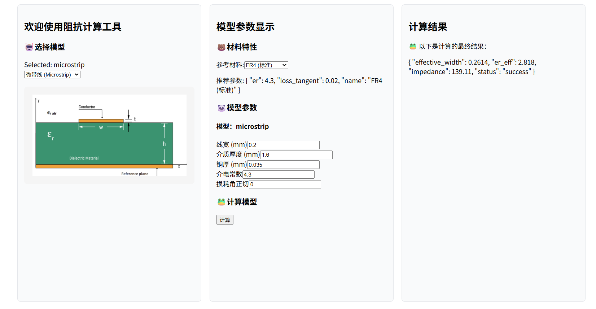

# 传输线阻抗计算器

一个功能强大的传输线阻抗计算应用，支持多种传输线类型的精确计算，适用于高速设计和射频电路设计。解决封装设计中的阻抗匹配难题。

* 界面截图：


## 📚 常用材料参数

| 材料          | 介电常数 | 损耗角正切 | 应用场景  |
| ------------- | -------- | ---------- | --------- |
| FR4 (标准)    | 4.3      | 0.02       | 通用PCB   |
| FR4 (高频)    | 4.1      | 0.015      | 高频应用  |
| Rogers 4003C  | 3.38     | 0.0027     | 高频/微波 |
| Rogers 4350B  | 3.48     | 0.0037     | 高速数字  |
| Isola 370HR   | 4.04     | 0.019      | 高速应用  |
| Teflon/PTFE   | 2.1      | 0.0002     | 超高频    |
| Polyimide     | 3.4      | 0.008      | 柔性板    |
| silicon硅     | 11.7     | 0.001      | 封装基板  |
| Alumina氧化铝 | 9.8      | 0.0001     | 高频/微波 |
| Glass玻璃     | 5.0      | 0.0005     | 高频应用  |
| ALN 氮化铝    | 8.5      | 0.0003     | 高频/微波 |

## 🏗️ 项目架构

```
Zcal/
├── backend/                 # 后端API服务 (Flask + Python)
│   ├── app/
│   │   ├── routes/         # API路由
│   │   ├── services/       # 业务逻辑
│   │   ├── models/         # 数据模型
│   │   └── utils/          # 工具函数
│   ├── run.py              # 后端入口
│   └── requirements.txt     # Python依赖
├── frontend/               # 前端应用 (Vue 3 + Vite)
│   ├── src/
│   │   ├── components/     # Vue组件
│   │   ├── views/          # 页面视图
│   │   ├── api/            # API客户端
│   │   └── styles/         # 样式文件
│   ├── package.json        # Node依赖
│   └── vite.config.js      # Vite配置
├── docker-compose.yml      # Docker编排配置
└── README.md              # 项目说明
```

## 🚀 功能特点

- **多种传输线类型**：

  - 微带线 (Microstrip)
  - 带状线 (Stripline)
  - 差分对 (Differential Pair)
  - 同轴线 (Coaxial)
  - GSSG 差分对
  - 嵌入式微带线
  - 偏移带状线
  - GCPW / CPWG
  - 宽边耦合带状线

- **精确计算**：

  - 考虑铜厚修正
  - 有效介电常数计算
  - 耦合系数分析
  - 椭圆积分计算
  - 导体和介质损耗
- **现代化界面** (Vue 3)：

  - 响应式设计
  - 实时参数验证
  - 详细结果展示
  - 结果导出功能

## 📋 快速启动

### 方法一：Docker Compose

```bash
cd docker
docker-compose up -d
```

然后访问：

- 前端: http://localhost:3000
- 后端API: http://localhost:5000/api

### 方法二：分别运行前后端

#### 后端启动（Python）

后端服务运行在 `http://localhost:5000`
```bash
cd backend
pip install -r requirements.txt
python run.py
```

#### 前端启动（Node.js）

前端应用运行在 `http://localhost:3000`

```bash
cd frontend
npm install
npm run dev
```

一键快速脚本：
```bash
start-all.sh  # Linux/Mac
start-all.ps1 # Windows
```


## 🔧 使用指南

### 微带线计算

- **适用场景**：外层走线，单面接地
- **主要参数**：线宽(W)、介质厚度(H)、铜厚(T)、介电常数(εr)
- **计算结果**：特征阻抗、有效介电常数

### 带状线计算

- **适用场景**：内层走线，双面接地
- **主要参数**：线宽(W)、介质总厚度(H)、铜厚(T)、介电常数(εr)
- **计算结果**：特征阻抗

### 差分对计算

- **适用场景**：高速数字信号，抗干扰
- **主要参数**：线宽(W)、线间距(S)、介质厚度(H)、铜厚(T)、介电常数(εr)
- **计算结果**：差分阻抗、单端阻抗、耦合系数

### 同轴线计算

- **适用场景**：高频应用，射频信号
- **主要参数**：内导体直径(d)、外导体内径(D)、介电常数(εr)
- **计算结果**：特征阻抗

### 封装基板计算

- **适用场景**：芯片封装，BGA
- **主要参数**：线宽(W)、介质厚度(H)、铜厚(T)、介电常数(εr)
- **计算结果**：特征阻抗

### 提交规范

- 添加新功能前请先提交Issue讨论
- 代码需要通过基本测试
- 提交信息请使用中文，描述清楚修改内容

## 📄 许可证

本项目采用 MIT 许可证 - 详见 [LICENSE](LICENSE) 文件

## 📞 联系方式

如有问题或建议，请通过以下方式联系：

- GitHub Issues
- 邮箱：[your-email@example.com]

---

**享受高速设计的乐趣！** 🎯
